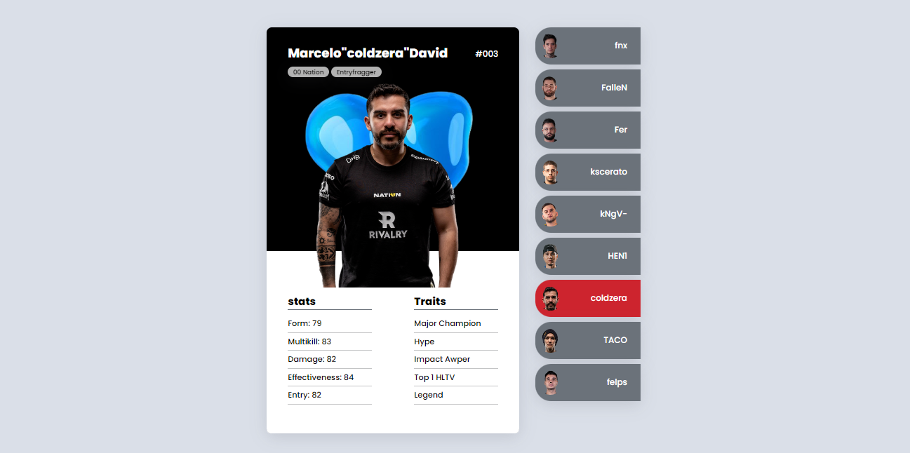
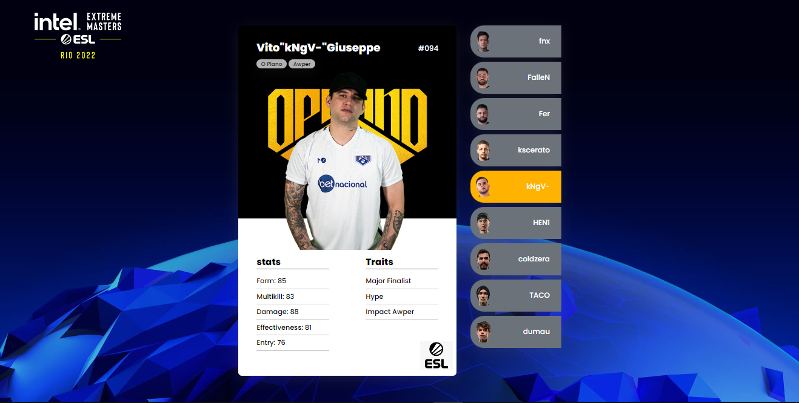

# IEM Rio Major 2022 Cards
The idea of ​​the project is to create a simple layout in html/css for professional Counter-Strike players cards. 

This layout was a test and can be used as inspiration for the graphic part of the [Get_Right Project](https://github.com/jorgeprj/GetRightProject).

## Description
A simple card layout, for **IEM RIO MAJOR 2022**, containing: name, role, team, stats, traits and images of the player and the team. For the example, the following players were used: **Fnx** *(Imperial)*, **Fallen** *(Imperial)*, **Fer** *(Imperial)*, **Kscerato** *(Furia)*, **Kng** *(O Plano)*, **Hen1** *(MIBR)*, **Coldzera** *(00 Nation)*, **Taco** *(00 Nation)* and **Dumau** *(00 Nation)*

### 1.1 VERSION

### 2.0 VERSION

For this new version, some details have been added. Like the ESL logo on all cards and the addition of the background used by the championship. In addition, as these are cards for the IEM RIO MAJOR 2022, there was a change of players: **Felps** *(Fluxo)* leaves  and **Dumau** *(00 Nation)* enters.

## Details

### Pro Players Cards

### Language

## Collaborators

<table>
  <tr>
    <td align="center">
      <a href="#">
         
        
          <b>@jorgeprj</b>
        
      </a>
    </td>
    

  </tr>
</table>

## Changelog

| Date | Change description | Developer | Version |
|-|-|-|-|
| 09/24/2022 | Creation | [@jorgeprj](https://github.com/jorgeprj) | 1.0
| 09/25/2022 | Add team logo behind each player | [@jorgeprj](https://github.com/jorgeprj) | 1.1
| 10/06/2022 | Update IEM RIO 2022| [@jorgeprj](https://github.com/jorgeprj) | 2.0

## External Links

* [Get_Right Project](https://github.com/jorgeprj/GetRightProject)
