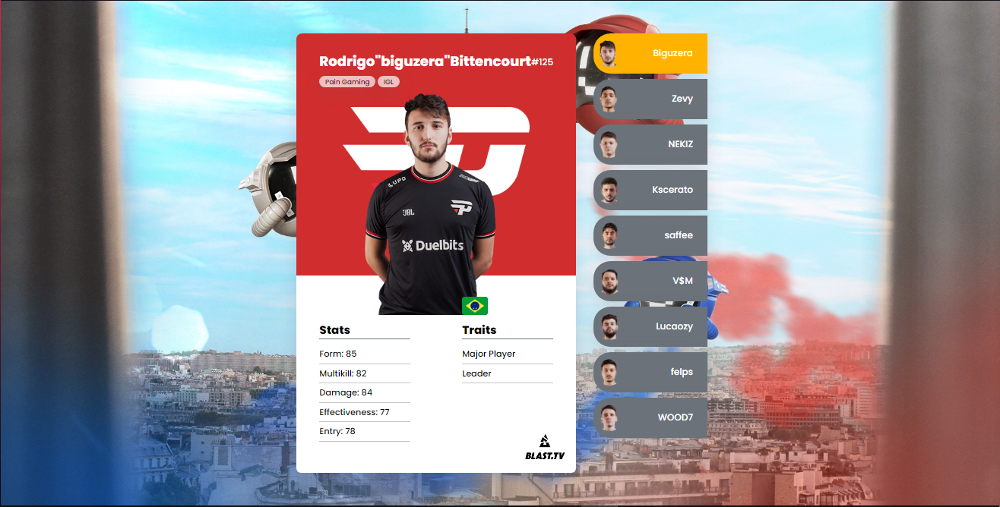

# CSGO Major Cards
The idea of ​​the project is to create a simple layout in html/css for professional Counter-Strike players cards. 

## Description
A simple card layout, for **CSGO Major Players**, containing: name, role, team, stats, traits, images of the player and the team and country. For the example, in the last release the following players were used: **Biguzera** *(Pain Gaming)*, **Zevy** *(Pain Gaming)*, **NEKIZ** *(Pain Gaming)*, **Kscerato** *(Furia)*, **saffee** *(Furia)*, **V$M** *(Fluxo)*, **Lucaozy** *(Fluxo)*, **felps** *(Fluxo)* and **WOOD7** *(Fluxo)*

### REALEASE 1.1

### REALEASE 2.0

For this version, some details have been added. Like the ESL logo on all cards and the addition of the background used by the championship. In addition, as these are cards for the IEM RIO MAJOR 2022, there was a change of players: **Felps** *(Fluxo)* leaves  and **Dumau** *(00 Nation)* enters.

### REALEASE 3.0

For this new version, the flag of each player's country has been added and files have been renamed to make it easier to understand. Also, players are removed while others are added as per BLAST Paris Major 2023.

**fnx** *(Imperial)* , **FalleN** *(Imperial)* , **Fer** *(Imperial)* , **kNgV-** *(O Plano)* , **HEN1** *(MIBR)* , **coldzera** *(00Nation)* , **TACO** *(00Nation)* and **dumau** *(00Nation)* leaves.

**Biguzera** *(Pain Gaming)* , **Zevy** *(Pain Gaming)* , **NEKIZ** *(Pain Gaming)* , **Saffee** *(Furia)* , **V$M** *(Fluxo)* , **Lucaozy** *(Fluxo)* and **WOOD7** *(Fluxo)* enters.

**felps** *(Fluxo)* returns.

## Details

### Pro Players Cards

### Language

## Changelog
Now the changelog can be checked by github itself in realeases. Unfortunately, only from version 2.0
